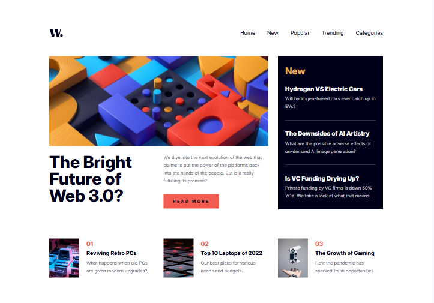

# Frontend Mentor - News homepage solution

This is a solution to the [News homepage challenge on Frontend Mentor](https://www.frontendmentor.io/challenges/news-homepage-H6SWTa1MFl). Frontend Mentor challenges help you improve your coding skills by building realistic projects.

## Table of contents

- [Overview](#overview)
  - [The challenge](#the-challenge)
  - [Screenshot](#screenshot)
  - [Links](#links)
- [My process](#my-process)
  - [Built with](#built-with)
  - [What I learned](#what-i-learned)
  - [Continued development](#continued-development)
  - [Useful resources](#useful-resources)
- [Author](#author)

## Overview

### The challenge

Users should be able to:

- View the optimal layout for the interface depending on their device's screen size
- See hover and focus states for all interactive elements on the page

### Screenshot



### Links

- Solution URL: [Github page](https://github.com/artemkotko14/news-homepage)
- Live Site URL: [Webpage](https://artemkotko14.github.io/news-homepage/)

## My process

### Built with

- Semantic HTML5 markup
- Flexbox
- CSS Grid
- Mobile-first workflow
- SASS

### What I learned

I learned some new shortcuts:

```html
.logo{text}+ul.nav-links>li*4>a
```

is a shortcut that give this result

```html
<div class="logo">text</div>
<ul class="nav-links">
  <li><a href=""></a></li>
  <li><a href=""></a></li>
  <li><a href=""></a></li>
  <li><a href=""></a></li>
</ul>
```

I learned about the inert attribute and how it can improve accessibility by making a section of the page completely non-interactive. The inert attribute also removes elements from the keyboard tab order and prevents screen readers from accessing them. I used it to disable interaction with the page content while the mobile navigation menu was open, creating a better user experience for both mouse and keyboard users.

```js
page.setAttribute("inert", "");
```

I learned how to use `window.matchMedia()` to detect when the viewport crosses a specific breakpoint in JavaScript. By listening for the change event, I was able to automatically close the mobile navigation menu when the screen resized to the desktop layout. This helped keep the navigation state synchronized with the responsive design, preventing issues where the mobile menu or overlay remained active after switching to a larger screen size.

```js
const desktop = window.matchMedia("(min-width: 950px)");

desktop.addEventListener("change", (e) => {
  if (e.matches) {
    // checks whether the media query currently matches, meaning the viewport has reached the desktop layout

    closeMobileMenu();
  }
});
```

### Continued development

This project reinforced the importance of planning the HTML structure before writing CSS. Going forward, I want to improve how I structure layouts to make responsive design and component reuse easier while continuing to strengthen my CSS Grid and accessibility skills.

## Author

- Github - [Artem Kotko](https://github.com/artemkotko14)
- Frontend Mentor - [@artemkotko14](https://www.frontendmentor.io/profile/artemkotko14)
